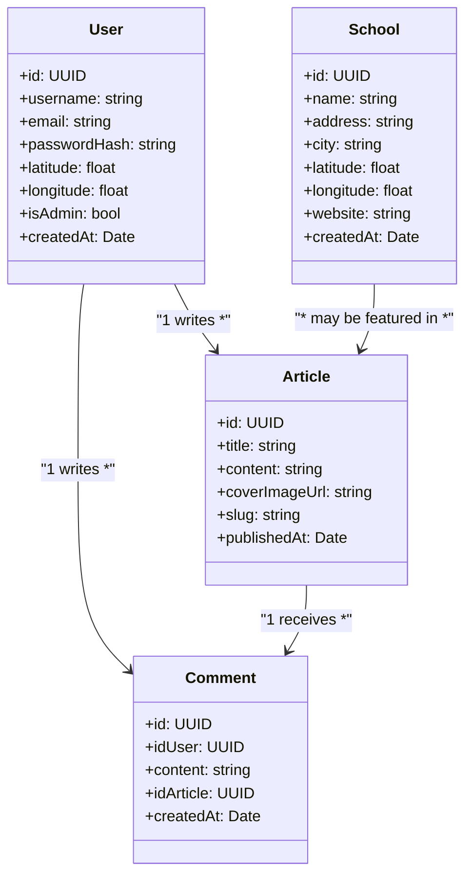
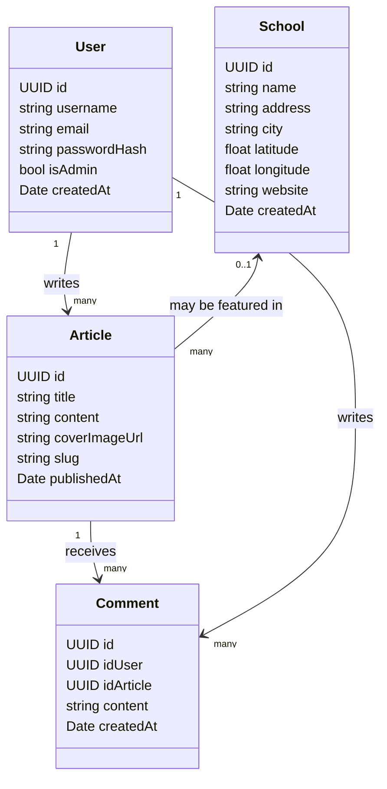
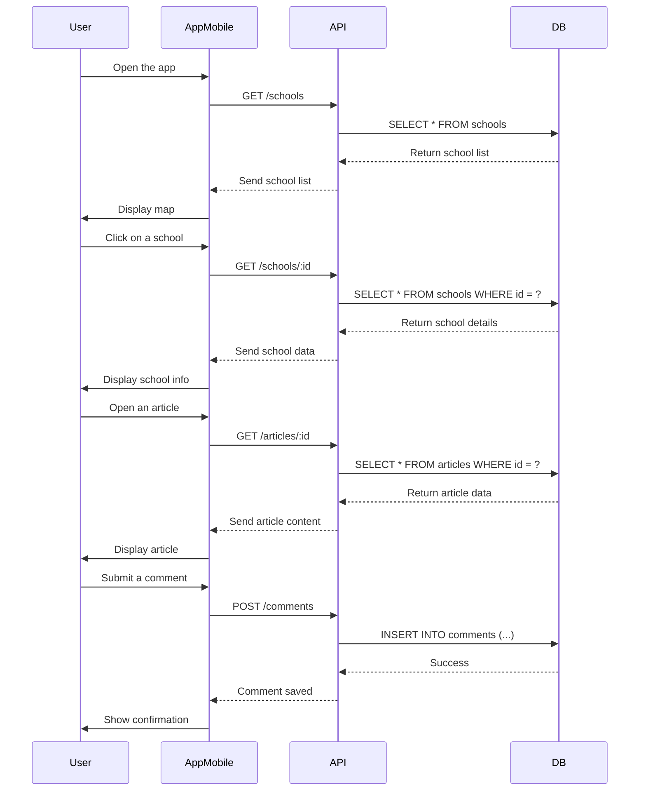
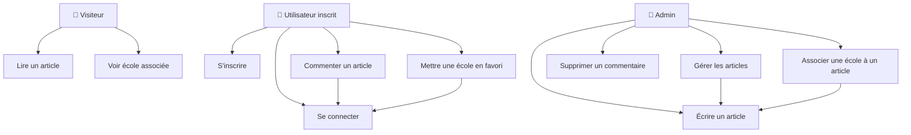
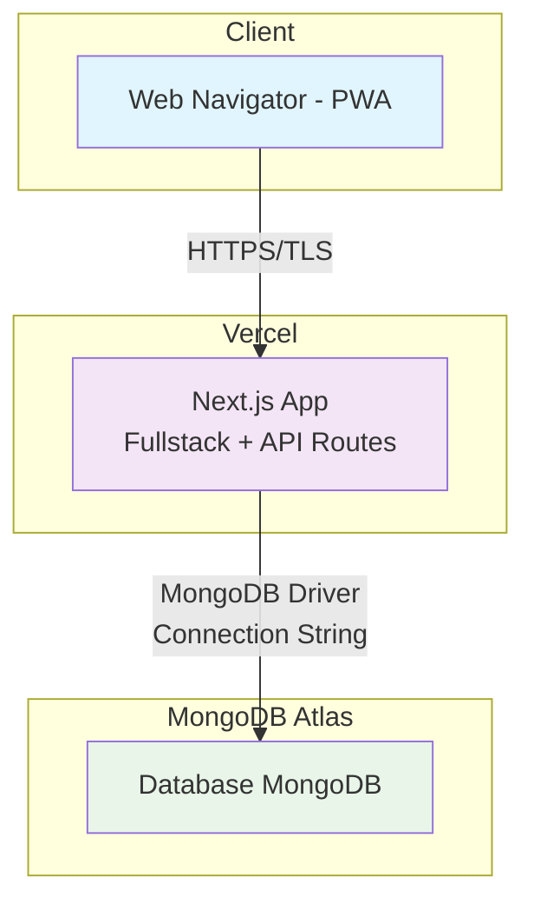

# Diagramme :

## Diagramme de classes

## Modélisation de la base de données

## Diagramme de Séquences

## Diagramme de cas d'utilisation

## Diagramme de déploiement 

## Matrice décisionnelle

| Critères                      | Coefficient | NextJS (PWA)  | React Native  | Flutter |
|-------------------------------|-------------|---------------|---------------|---------|
| Déploiement                   | 5           | 5             | 3             | 3       |
| Système d'authentification    | 3           | 4             | 4             | 5       |
| Performance mobile            | 4           | 2             | 4             | 5       |
| Performance web               | 3           | 5             | 2             | 2       |
| Développement multiplateforme | 4           | 3             | 5             | 5       |
| Communauté                    | 4           | 5             | 5             | 3       |
| Total                         |             | 92            | 89            | 88      |

### Avantages déterminants :
#### Développement fullstack : 
- Next.js permet de gérer le front-end et le back-end dans un même projet
#### Facilité de déploiement : 
- Intégration native avec Vercel pour un déploiement simplifié
#### PWA (Progressive Web App) :
- Permet de créer une application accessible sur web et mobile
#### Routage intégré : 
- Système de routage puissant et intuitif
#### Compromis acceptables :
- Le seul point faible notable est l'utilisation du responsive design au lieu d'une optimisation mobile native. Cependant, avec les frameworks CSS modernes comme Tailwind CSS (déjà configuré dans votre projet), cela reste une solution viable.
#### Comparaison avec les alternatives :
- React Native aurait nécessité un backend séparé
Flutter présente des limitations au niveau du design et de l'intégration backend
Le choix de Next.js apparaît donc comme le meilleur compromis pour développer une application web responsive qui peut fonctionner sur tous les supports, tout en gardant une base de code unique et facilement maintenable.