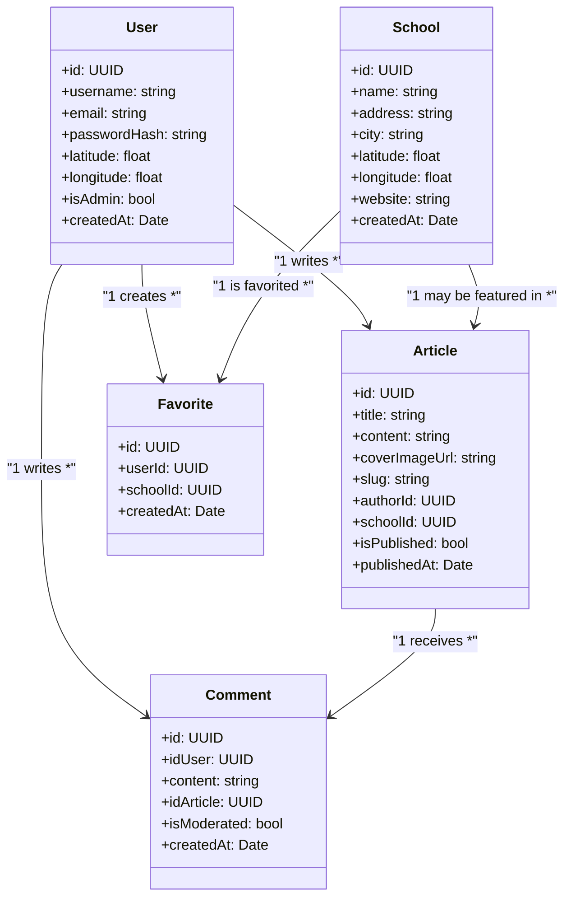
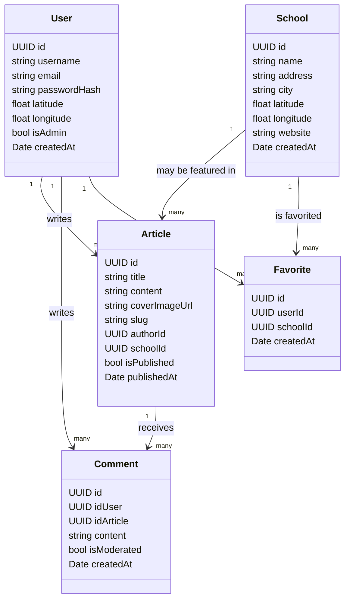
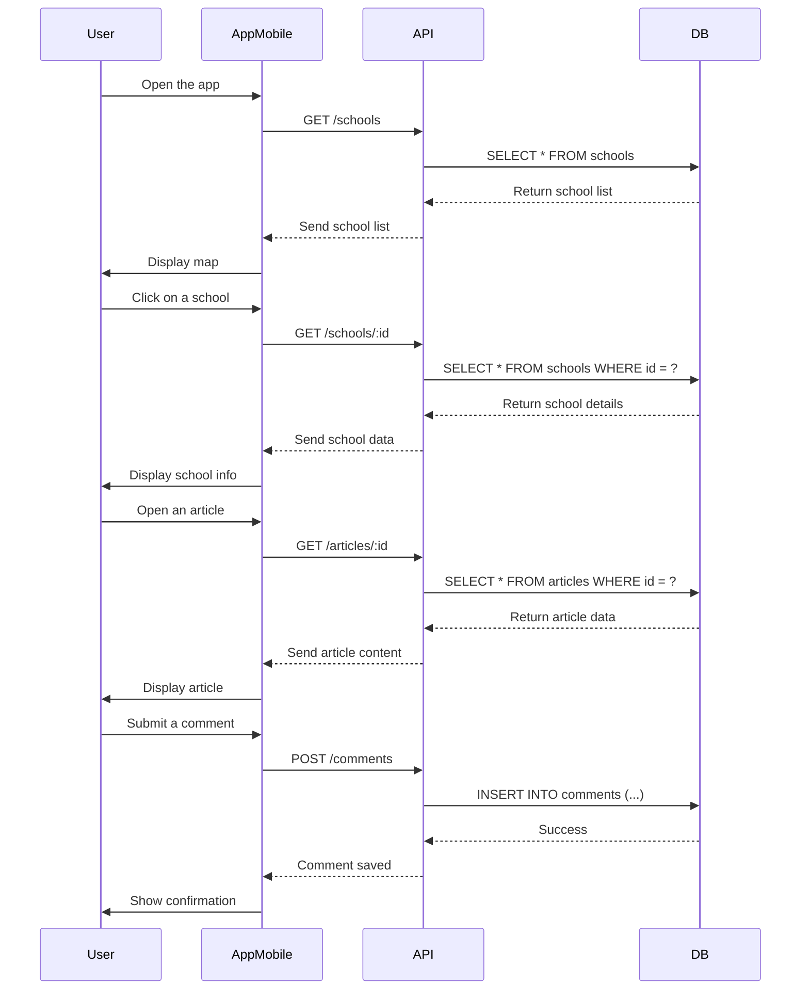
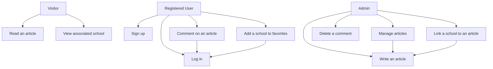
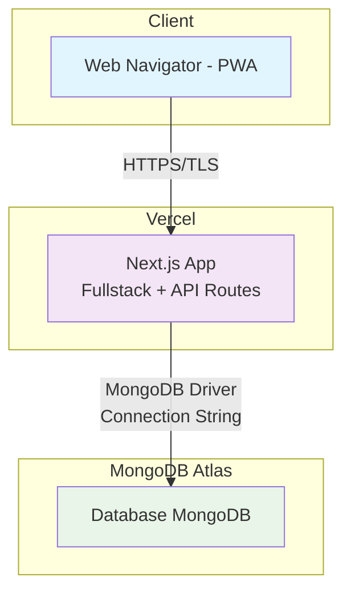

# ANOMI
Une application d'information et de promotion d'écoles d'animation.

## Introduction

### Contexte du projet

ANOMI est une application web progressive (PWA) conçue pour faciliter la découverte et la promotion des écoles d'animation. Dans un secteur en pleine expansion, où l'offre de formation en animation se diversifie rapidement, il devient crucial de disposer d'un outil centralisé permettant aux étudiants potentiels de découvrir et comparer les différentes écoles disponibles.

### Objectifs

L'application ANOMI répond à plusieurs besoins identifiés :

- **Centralisation de l'information** : Regrouper les informations sur les écoles d'animation en un seul endroit accessible
- **Géolocalisation** : Permettre aux utilisateurs de localiser facilement les écoles proches de leur position
- **Contenu éditorial** : Proposer des articles informatifs sur le secteur de l'animation et les formations
- **Interaction communautaire** : Faciliter les échanges entre futurs étudiants via un système de commentaires
- **Accessibilité multiplateforme** : Offrir une expérience utilisateur optimale sur web et mobile

### Périmètre fonctionnel

L'application s'articule autour de trois types d'utilisateurs :

1. **Visiteurs** : Consultation libre des articles et informations sur les écoles
2. **Utilisateurs inscrits** : Fonctionnalités interactives (commentaires, favoris)
3. **Administrateurs** : Gestion du contenu éditorial et modération

### Architecture technique

Le projet adopte une approche fullstack avec Next.js, permettant de gérer frontend et backend dans un environnement unifié. Cette architecture garantit :

- Une maintenance simplifiée
- Des performances optimisées
- Un déploiement facilité
- Une évolutivité maîtrisée

### Méthodologie

Ce dossier technique présente l'analyse comparative des solutions techniques, la modélisation des données, et l'architecture système retenue. Il constitue le référentiel technique pour le développement et la maintenance de l'application ANOMI.

## Choix techniques
### Matrice décisionnelle

| Critères                      | Coefficient | NextJS (PWA)  | React Native  | Flutter |
|-------------------------------|-------------|---------------|---------------|---------|
| Déploiement                   | 5           | 5             | 3             | 3       |
| Système d'authentification    | 3           | 4             | 4             | 5       |
| Performance mobile            | 4           | 2             | 4             | 5       |
| Performance web               | 3           | 5             | 2             | 2       |
| Développement multiplateforme | 4           | 3             | 5             | 5       |
| Communauté                    | 4           | 5             | 5             | 3       |
| Total                         |             | 92            | 89            | 88      |

#### Avantages déterminants :
##### Développement fullstack : 
- Next.js permet de gérer le front-end et le back-end dans un même projet
##### Facilité de déploiement : 
- Intégration native avec Vercel pour un déploiement simplifié
##### PWA (Progressive Web App) :
- Permet de créer une application accessible sur web et mobile
##### Routage intégré : 
- Système de routage puissant et intuitif
##### Compromis acceptables :
- Le seul point faible notable est l'utilisation du responsive design au lieu d'une optimisation mobile native. Cependant, avec les frameworks CSS modernes comme Tailwind CSS, cela reste une solution viable.
##### Comparaison avec les alternatives :
- React Native aurait nécessité un backend séparé
- Flutter présente des limitations au niveau du design et de l'intégration backend

Le choix de Next.js apparaît donc comme le meilleur compromis pour développer une application web responsive qui peut fonctionner sur tous les supports, tout en gardant une base de code unique et facilement maintenable.

## Diagrammes
### Diagramme de classes

Ce diagramme présente la structure objet de l'application en définissant les entités principales (User, School, Article, Comment) avec leurs attributs et les relations qui les lient, permettant de visualiser l'architecture logique des données et leurs interactions.

### Modélisation de la base de données

Ce diagramme traduit le modèle objet en structure de base de données, spécifiant les types de données, les clés primaires et étrangères, ainsi que les cardinalités des relations pour l'implémentation MongoDB.

### Diagramme de Séquences

Ce diagramme illustre les interactions dynamiques entre l'utilisateur, l'application mobile, l'API et la base de données lors des principales fonctionnalités (consultation des écoles, lecture d'articles, ajout de commentaires), détaillant le flux temporel des messages échangés.

### Diagramme de cas d'utilisation

Ce diagramme identifie les différents acteurs du système (Visiteur, Utilisateur inscrit, Admin) et leurs cas d'utilisation respectifs, mettant en évidence les fonctionnalités accessibles selon le niveau d'autorisation et les dépendances entre les actions.

### Diagramme de déploiement 

Ce diagramme représente l'architecture physique de déploiement de l'application, montrant la répartition des composants entre le client (PWA), le serveur Vercel (Next.js) et la base de données MongoDB Atlas, avec les protocoles de communication utilisés.

## Annexes

### Dépôt GitHub
Voici le lien du dépôt GitHub : [Lien du dépôt](https://github.com/KerdanetYvan/absolute-app)

### Notion
Nous suivons l'avancement du projet grâce à Notion.
[Lien du Notion](https://clumsy-houseboat-021.notion.site/Suivi-projet-2154e227b44b802d9603f3979091adb9)